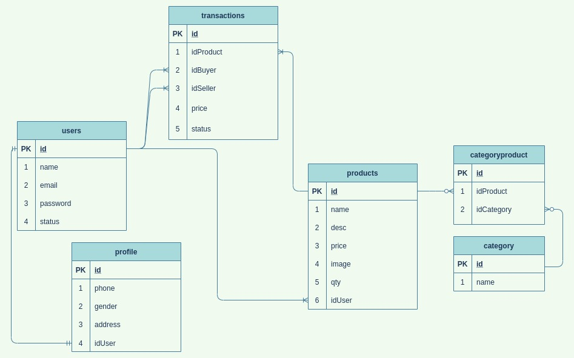

### Table of Contents

- [Database Preparation for Relation](#database-preparation-for-relation)
  - [Database Design](#database-design)
  - [Models](#models)
  - [Data Transfer Object (DTO)](#data-transfer-object-dto)
  - [Split Modify for Connection](#modify-repository)

---

# Database Preparation for Relation

## Database Design



## Models

- Create `user.go` file inside `models` folder, and write this below code

  > File: `models/user.go`

  ```go
  package models

  import "time"

  type User struct {
    ID        int       `json:"id"`
    Name      string    `json:"name" gorm:"type: varchar(255)"`
    Email     string    `json:"email" gorm:"type: varchar(255)"`
    Password  string    `json:"-" gorm:"type: varchar(255)"`
    CreatedAt time.Time `json:"-"`
    UpdatedAt time.Time `json:"-"`
  }

  type UsersProfileResponse struct {
    ID   int    `json:"id"`
    Name string `json:"name"`
  }

  func (UsersProfileResponse) TableName() string {
    return "users"
  }
  ```

- Create `profile.go` file inside `models` folder, and write this below code

  > File: `models/profile.go`

  ```go
  package models

  import "time"

  type Profile struct {
    ID        int                  `json:"id" gorm:"primary_key:auto_increment"`
    Phone     string               `json:"phone" gorm:"type: varchar(255)"`
    Gender    string               `json:"gender" gorm:"type: varchar(255)"`
    Address   string               `json:"address" gorm:"type: text"`
    UserID    int                  `json:"user_id"`
    User      UsersProfileResponse `json:"user"`
    CreatedAt time.Time            `json:"-"`
    UpdatedAt time.Time            `json:"-"`
  }

  // for association relation with another table (user)
  type ProfileResponse struct {
    Phone   string `json:"phone"`
    Gender  string `json:"gender"`
    Address string `json:"address"`
    UserID  int    `json:"-"`
  }

  func (ProfileResponse) TableName() string {
    return "profiles"
  }
  ```

- Create `product.go` file inside `models` folder, and write this below code

  > File: `models/product.go`

  ```go
  package models

  import "time"

  type Product struct {
    ID         int                  `json:"id" gorm:"primary_key:auto_increment"`
    Name       string               `json:"name" form:"name" gorm:"type: varchar(255)"`
    Desc       string               `json:"desc" gorm:"type:text" form:"desc"`
    Price      int                  `json:"price" form:"price" gorm:"type: int"`
    Image      string               `json:"image" form:"image" gorm:"type: varchar(255)"`
    Qty        int                  `json:"qty" form:"qty"`
    UserID     int                  `json:"user_id" form:"user_id"`
    User       UsersProfileResponse `json:"user"`
    Category   []Category           `json:"category" gorm:"many2many:product_categories"`
    CategoryID []int                `json:"category_id" form:"category_id" gorm:"-"`
    CreatedAt  time.Time            `json:"-"`
    UpdatedAt  time.Time            `json:"-"`
  }

  type ProductResponse struct {
    ID         int                  `json:"id"`
    Name       string               `json:"name"`
    Desc       string               `json:"desc"`
    Price      int                  `json:"price"`
    Image      string               `json:"image"`
    Qty        int                  `json:"qty"`
    UserID     int                  `json:"-"`
    User       UsersProfileResponse `json:"user"`
    Category   []Category           `json:"category" gorm:"many2many:product_categories"`
    CategoryID []int                `json:"category_id" form:"category_id" gorm:"-"`
  }

  type ProductUserResponse struct {
    ID     int    `json:"id"`
    Name   string `json:"name"`
    Desc   string `json:"desc"`
    Price  int    `json:"price"`
    Image  string `json:"image"`
    Qty    int    `json:"qty"`
    UserID int    `json:"-"`
  }

  func (ProductResponse) TableName() string {
    return "products"
  }

  func (ProductUserResponse) TableName() string {
    return "products"
  }
  ```

- Create `category.go` file inside `models` folder, and write this below code

  > File: `models/category.go`

  ```go
  package models

  import "time"

  type Category struct {
    ID        int       `json:"id" gorm:"primary_key:auto_increment"`
    Name      string    `json:"name"`
    CreatedAt time.Time `json:"-"`
    UpdatedAt time.Time `json:"-"`
  }
  ```

- Create `transaction.go` file inside `models` folder, and write this below code

  > File: `models/transaction.go`

  ```go
  package models

  import "time"

  type Transaction struct {
    ID        int                  `json:"id" gorm:"primary_key:auto_increment"`
    ProductID int                  `json:"product_id"`
    Product   ProductResponse      `json:"product"`
    BuyerID   int                  `json:"buyer_id"`
    Buyer     UsersProfileResponse `json:"buyer"`
    SellerID  int                  `json:"seller_id"`
    Seller    UsersProfileResponse `json:"seller"`
    Price     int                  `json:"price"`
    Status    string               `json:"status"  gorm:"type:varchar(25)"`
    CreatedAt time.Time            `json:"-"`
    UpdatedAt time.Time            `json:"-"`
  }
  ```

## Data Transfer Object (DTO)

- Create `auth` folder, inside it Create `auth_request.go` and write this below code

  > File: `dto/auth/auth_request.go`

  ```go
  package authdto

  type AuthRequest struct {
    Name     string `gorm:"type: varchar(255)" json:"name"`
    Email    string `gorm:"type: varchar(255)" json:"email"`
    Password string `gorm:"type: varchar(255)" json:"password"`
  }
  ```

- Create `product` folder, inside it Create `product_request.go` and write this below code

  > File: `dto/product/product_request.go`

  ```go
  package productdto

  type ProductRequest struct {
    Name       string `json:"name" form:"name" gorm:"type: varchar(255)"`
    Desc       string `json:"desc" gorm:"type:text" form:"desc"`
    Price      int    `json:"price" form:"price" gorm:"type: int"`
    Image      string `json:"image" form:"image" gorm:"type: varchar(255)"`
    Qty        int    `json:"qty" form:"qty" gorm:"type: int"`
    UserID     int    `json:"user_id" gorm:"type: int"`
    CategoryID int    `json:"category_id" form:"category_id" gorm:"type: int"`
  }
  ```

- Create `profile` folder, inside it Create `profile_request.go` and write this below code

  > File: `dto/profile/profile_request.go`

  ```go
  package profiledto

  import "dumbmerch/models"

  type ProfileResponse struct {
    ID      int                         `json:"id" gorm:"primary_key:auto_increment"`
    Phone   string                      `json:"phone" gorm:"type: varchar(255)"`
    Gender  string                      `json:"gender" gorm:"type: varchar(255)"`
    Address string                      `json:"address" gorm:"type: text"`
    UserID  int                         `json:"user_id"`
    User    models.UsersProfileResponse `json:"user"`
  }
  ```

## Modify Repository

- Inside `repositories` folder, create `repository.go` file, and write this below code

  > File: `repositories/repository.go`

  ```go
  package repositories

  import "gorm.io/gorm"

  type repository struct {
    db *gorm.DB
  }
  ```

  \*`repository` struct move from `user.go` file
